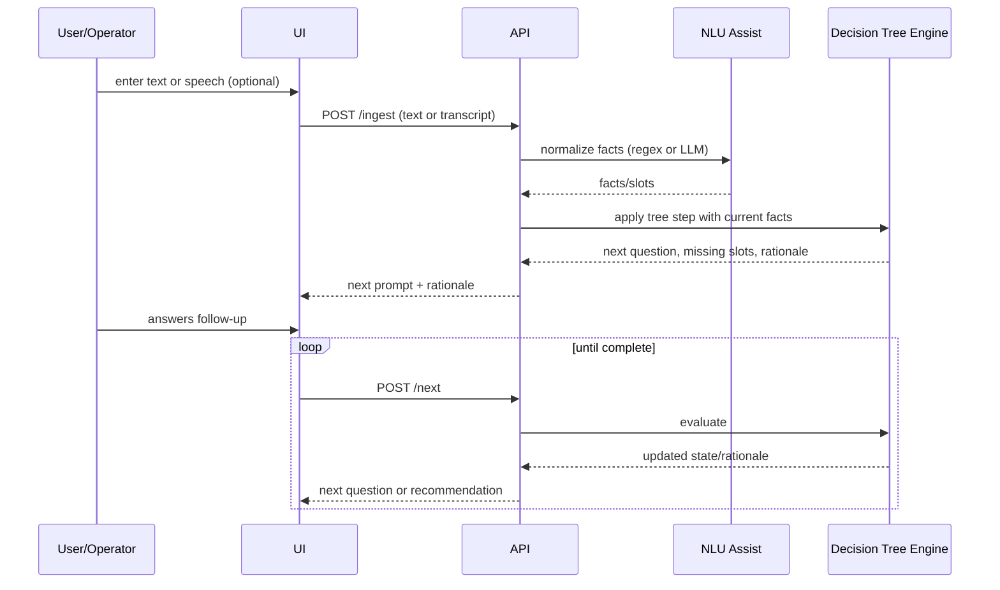

# Conversational Decision Support – Architecture (Beta)

## 1) Purpose and Scope
- Beta proof-of-concept to show feasibility and simplicity.
- Core flows: conversational intake (text-first, optional speech) and operator elbow support prompts.
- Constraints: narrow decision tree, explainable logic, minimal persistence, no auth, no enterprise integrations in Phase 1.

## 2) High-Level Architecture
- **UI (Web SPA)**: Chat-style interface; shows follow-up questions, recommendations, and rationale. Operator mode toggle for prompts during live/simulated calls.
- **API Layer (Lightweight backend)**: REST endpoints for ingest, step, and recommend. Stateless; session context passed by token or held in-memory for the demo.
- **Decision Logic**: Explicit decision tree/rules in JSON/YAML; interpreter chooses next questions, tracks missing facts, and produces recommendations plus trace.
- **NLU Assist (Optional/Flagged)**: Slot extraction via simple keyword/regex; optional LLM for entity extraction/normalization. Speech-to-text (STT) optional/simulated behind a feature flag.
- **Data/State**: Session state (slots, history, rule trace) in memory; decision tree versioned in repo for transparency.

## 2a) Diagrams
```mermaid
flowchart LR
  UI[UI - Chat + Operator Panel]
  API[API Layer]
  NLU[NLU Assist: regex or LLM (flagged)]
  TREE[Decision Tree Engine]
  STATE[In-memory Session State]

  UI -->|text or speech| API
  API -->|normalize slots| NLU
  API -->|evaluate| TREE
  TREE -->|next question + rationale| API
  API -->|response| UI
  API -->|session context| STATE
```



## 3) Key Components
- UI: Chat panel, input box, rationale sidebar, operator prompts panel; session-local storage for continuity.
- API:
  - `POST /ingest`: Accept text (and optional audio), run NLU normalization.
  - `POST /next`: Apply decision tree to current state, return next questions + rationale + missing fields.
  - `POST /recommendation`: Return final recommendation and supporting trace.
- Decision Tree Engine:
  - Tree defined as JSON (nodes, conditions, actions, questions).
  - Interpreter maintains state machine; emits “why” (rule IDs, matched conditions).
  - Easy to edit and review (kept in repo).
- Integrations (flagged/optional): STT (e.g., Whisper API), LLM (e.g., GPT for slot extraction). Safe to ship without them.

## 4) Data Model (minimal)
- Session: `{ sessionId, facts/slots, history, ruleTrace }`
- Tree node: `{ id, question, condition, slotsNeeded, nextNode, recommendation? }`
- NLU result: `{ normalizedFacts, confidence?, rawText, source }`

## 5) Explainability
- Each API response includes: matched rules, missing facts, chosen next question, and rationale string.
- Trace persisted in-memory for the session; visible in UI sidebar.

## 6) Deployment Approach
- Local-first: simple `npm run dev` or `docker-compose up`.
- Hosting (beta): small VM/Render/Fly; SPA on Netlify/Vercel if preferred.
- Feature flags: `enableLLM`, `enableSTT`, `operatorMode`.

## 7) Phase 1 (build now)
- Single-domain, narrow decision tree (≈20–40 nodes).
- Text-first chat UI; speech simulated or minimal STT integration.
- Regex/keyword NLU; optional LLM for normalization only.
- In-memory sessions; no auth; basic logging.
- Rationale/trace displayed in UI.

## 8) Deferred (Phase 2+)
- Auth/roles, durable persistence, audit logs.
- Rich analytics and A/B testing for tree variants.
- Robust STT/TTS, phone/voice streaming integration.
- PII handling, encryption at rest, SOC2-grade controls.
- CI/CD hardening and automated load/perf tests.

## 9) Risks and Mitigations
- Ambiguous user input: mitigate with targeted follow-up questions and clear missing-slot prompts.
- Overreach with LLM: keep LLM behind a flag; default to deterministic rules.
- Scope creep: fix the tree domain/size; lock Phase 1 to text-first.

## 10) Next Steps
- Confirm target domain and draft the 20–40-node tree.
- Choose stack (e.g., React + FastAPI/Fastify) and hosting target.
- Decide on enabling LLM/STT flags for the demo.
- Build the walking skeleton: ingest → next question → recommendation with rationale.

